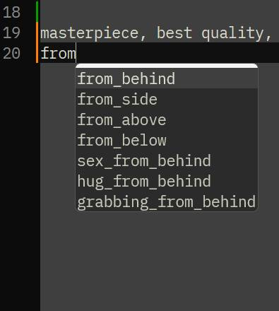
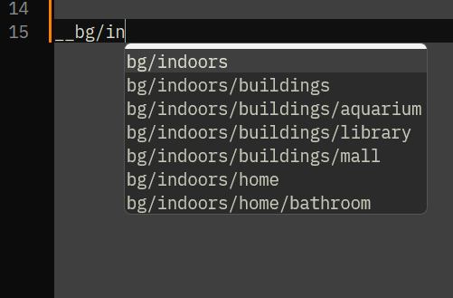

# tagAutoComplete-npp
Tag Auto Completion for Notepad++ Python Script.

tagAutoComplete-npp はNotepad++上に入力補完機能(いわゆるTag Autocomplete)を実装するスクリプトです。

## 導入方法
- Notepad++用のプラグイン [Python Script](https://github.com/bruderstein/PythonScript) を利用します。事前にNotepad++に導入してください。
- tagAutoComplete.py を PythonScript の User Scripts フォルダに入れてください。
  - Notepad++の設定を変えていなければ %APPDATA%\Notepad++\plugins\config\PythonScript\scripts
- タグ情報の入ったCSVファイルを tagAutoComplete.py と同じフォルダに置いてください。
  - CSVファイルの一列目の値をタグとして扱います(二列目以降の値は利用しません)。
  - CSVファイルの一行目にヘッダー行がある場合は削除してください。
  - 上の方にあるデータから優先的に表示します。
  - __付属のdanbooru.csvはサンプルです。適当なデータをご用意ください。__

## 利用前の設定
- Notepad++の標準の設定では / や - 等の文字は単語の一部として認識されません
  - 例: half-closed_eyes は - が入っているため途中で補完が出来なくなります
  - それらの文字を使用する場合はNotepad++の [設定]->[環境設定]->[区切り記号]->[単語の一部と見なす文字を追加する] に文字を追加してください
    - Notepad++全体に影響する設定ですので、他の機能に影響する可能性があります
  - ワイルドカード補完機能を使用する場合は / の登録が必須です

## 使い方
- Notepad++のメニューから 「プラグイン」->「Python Script」->「Scripts」->「tagAutoComplete」で実行
  - 対象のファイルを開いた時に自動で有効化されます。
- スクリプトを終了したい時はもう一度スクリプトを実行してください。
- スペースを含むタグを補完する時はスペースをアンダーバーに置き換えて入力してください。
  - 例: flat chest -> flat_chest

## デフォルトの設定
- ファイル名の末尾が '.txt' になっているファイルで入力補完を有効化
- 同じフォルダにある 'danbooru.csv' からタグ一覧を読み込む
- 2文字目から補完メニューを表示する
- メニューに表示する候補数:7
- アンダーバーを半角スペースに置き換え
- 次の文字をエスケープする: ( )
- 区切り文字 ', '
- タグと区切り文字の間にある半角スペースを削除する
- 部分一致で検索
- (デフォルトの設定を変更する時は tagAutoComplete.py をテキストエディタで開いて、説明文の下にある変数の値を変えてください)

## ワイルドカード補完
- tagAutoComplete.py をテキストエディタで開いて WILDCARD_DIR = r'C:\my\wildcard' の値をワイルドカードを保存しているフォルダに変更してください
- __から開始する単語はワイルドカードとして認識されます

